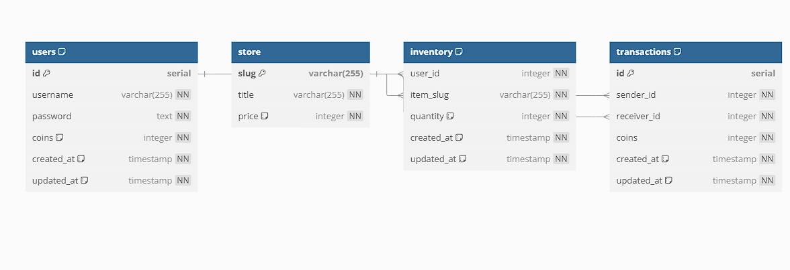

### Стажировка Avito 2025 Backend

Это сервис для внутреннего магазина мерча Авито.


### Установка и запуск
```bash
git clone https://github.com/DigiRon4ik/AvitoBTA2025-github.com/kk7453603/avito_2024_summer.git
cd avito_2024_summer
```
### Запуск сервисов в Docker compose
```bash
docker-compose up -d
```

### Остановка сервиса (можно удалить volumes при остановке с фалгом --volumes)
```bash
docker-compose down
```


### Make – запуск и остановка
Запуск:
  ```make d-up```

Остановка:
  ```make d-down```

## Дополнительные команды Make

- Применить миграции к реальной базе данных:
  ```make m-up```

- Откатить миграции в базе данных:
  ```make m-down```

- Проверить версию миграций:
  ```make m-status```

- Пересобрать проект и запустить сервис:
 ``` make d-up-b```

- Остановить сервис и удалить все данные:
  ```make d-down-v```

- Запустить сервис, если в базе остались данные:
  ```make d-up-app```

- Запустить линтер:
  ```make lint```

- Выполнить только юнит-тесты:
  ```make tests```

- Выполнить юнит- и интеграционные тесты:
  ```make tests-integration```

- Выполнить юнит-тесты с генерацией отчета в HTML:
  ```make cover```

- Выполнить юнит- и интеграционные тесты с генерацией отчета в HTML:
  ```make cover-integration```

### API

#### Эндпоинты:
- Аутентификация:
  - Метод: POST
  - Эндпоинт: /api/auth
  - Тело запроса: {"username": ```<string>```, "password": ```<string>```}

- Информация:
  - Метод: GET
  - Эндпоинт: /api/info
  - Тело запроса: отсутствует
  - Загловок: ```Authorization: Bearer <Token>```

- Передача монет:
  - Метод: POST
  - Эндпоинт: /api/sendCoin
  - Тело запроса: {"toUser": ```<string>```, "amount": ```<integer>```}
  - Загловок: ```Authorization: Bearer <Token>```

- Покупка товара:
  - Метод: GET
  - Эндпоинт: /api/buy/:item
  - Тело запроса: отсутствует
  - Загловок: ```Authorization: Bearer <Token>```

---
---
- Пример эндпоинта, при запуске контейнера в docker:
  - localhost:8080/api/info
---
---

### Схема базы данных
